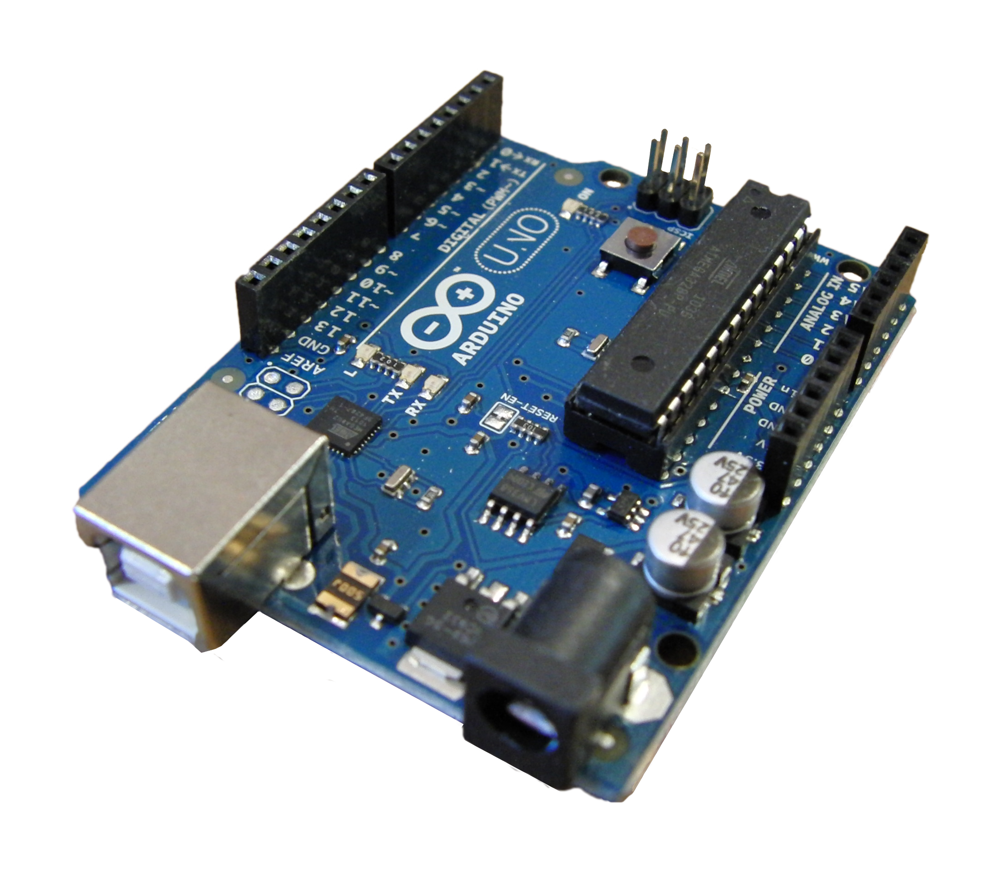
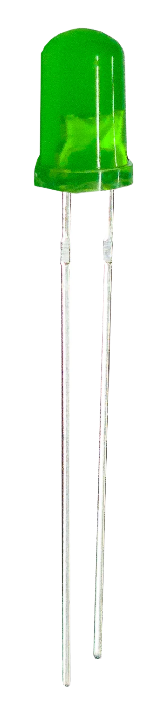
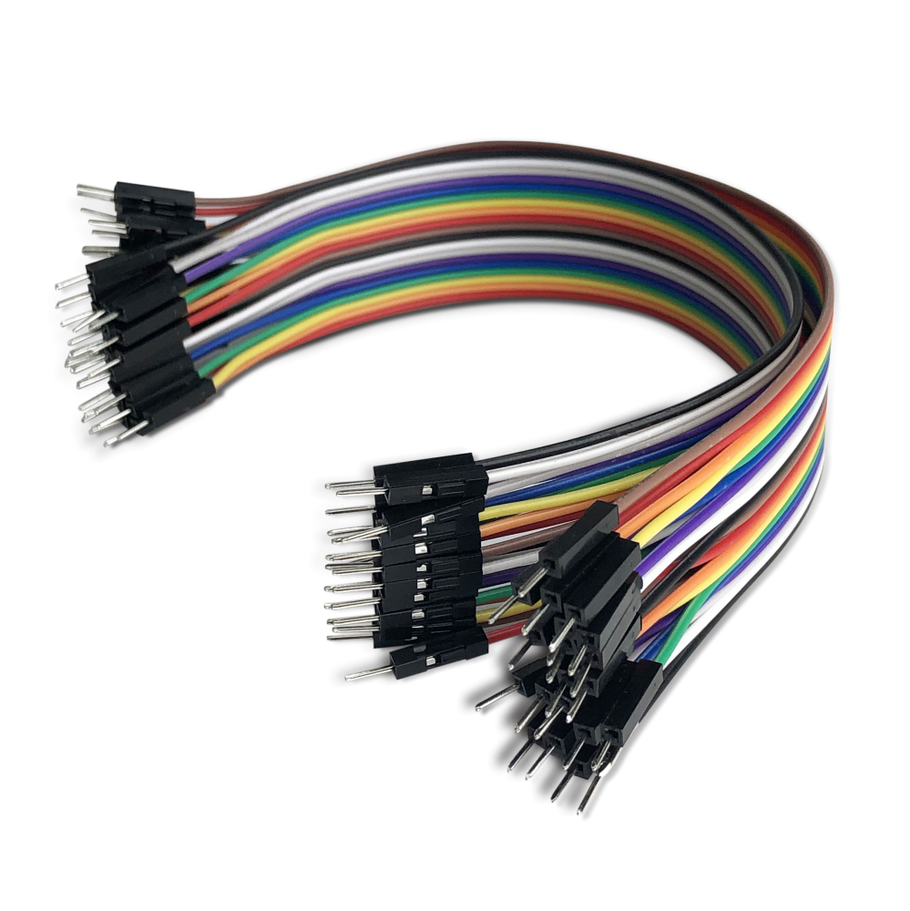
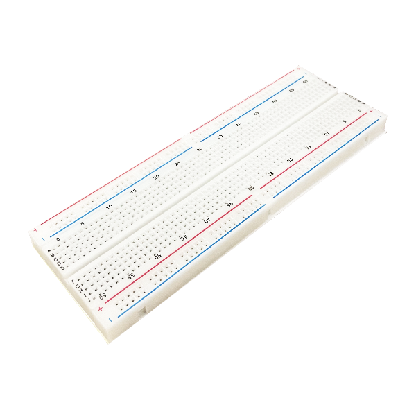
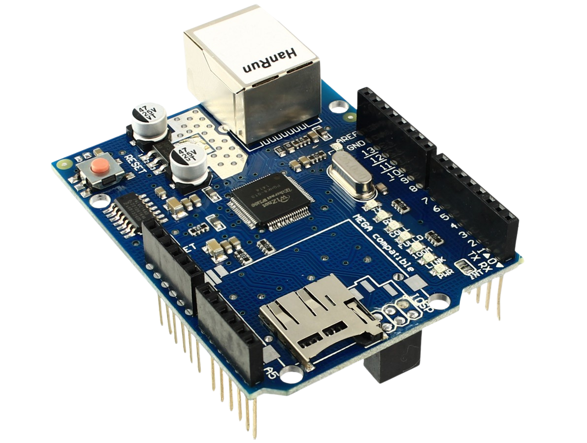
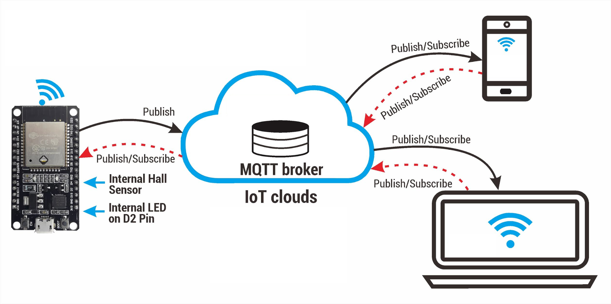
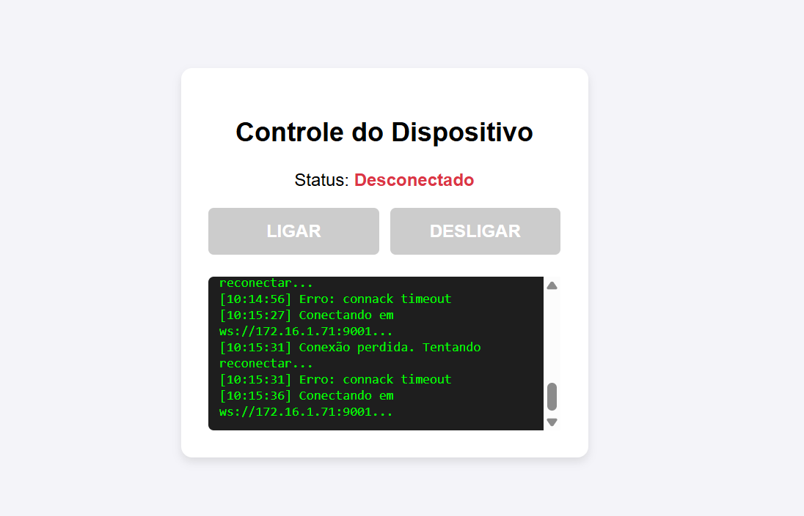

# Projeto: Controle de LED via MQTT com Arduino e Site

## 👥 Integrantes do Grupo

<table align="center">
  <tr>
    <td align="center">
       
      <b>BielVereda</b>
    </td>
    <td align="center">
       
      <b>Francisco-Alamino-Neto</b>
    </td>
    <td align="center">
       
      <b>GabrielLima1534</b>
    </td>
    <td align="center">
       
      <b>GoBrazill</b>
    </td>
    <td align="center">
       
      <b>RodrigoJPSilva</b>
    </td>
    <td align="center">
       
      <b>srjuninn</b>
    </td>
  </tr>
</table>

---

## 📖 Introdução
Este projeto foi desenvolvido como parte da disciplina de iniciação em IoT e redes de comunicação. O objetivo é compreender o funcionamento do **Broker MQTT**, implementar um protótipo em **Arduino Uno com Shield Ethernet W5100**, e criar um **site em HTML/JavaScript** que permita controlar e monitorar o estado de um LED em tempo real.

---

## 🔎 O que é um Broker?
Um **Broker MQTT** é o servidor responsável por receber mensagens de dispositivos (publishers) e distribuí-las para outros dispositivos ou aplicações (subscribers). Ele atua como intermediário, garantindo que a comunicação seja simples, leve e eficiente.

---

## 🔎 Como funciona o modelo MQTT?
O **MQTT** é um protocolo de comunicação baseado em **publish/subscribe**:
- **Publisher**: envia mensagens para um tópico.  
- **Broker**: recebe e distribui mensagens.  
- **Subscriber**: assina um tópico e recebe as mensagens publicadas nele.  

No nosso projeto:
- O **site** publica comandos no tópico `led/control`.  
- O **Arduino** assina esse tópico e acende/apaga o LED.  
- O **Arduino** publica o estado atual no tópico `led/status`.  
- O **site** assina esse tópico e mostra o estado em tempo real.

---

## ⚙️ Componentes utilizados
- Arduino Uno  
- Ethernet Shield W5100  
- LED + resistor  
- Broker Mosquitto (instalado no notebook)  
- Site em HTML/CSS/JS com MQTT.js  

---

## 🖥️ Desenvolvimento
1. **Configuração do Mosquitto**  
   - Porta **1883** para o Arduino (TCP MQTT).  
   - Porta **9001** para o site (WebSocket).  

2. **Código Arduino**  
   - Assina `led/control`.  
   - Publica em `led/status`.  

3. **Site HTML/JS**  
   - Botões para ligar/desligar LED.  
   - Assina `led/status` para mostrar feedback.  

---

## 📸 Fotos do protótipo

### Quais Materiais Utilizamos?

<table align="center">
  <tr>
    <td align="center">
       
      Arduino UNO
    </td>
    <td align="center">
       
      LED
    </td>
    <td align="center">
       
      Jumpers
    </td>
    <td align="center">
       
      Protoboard
    </td>
    <td align="center">
       
      Ethernet Shield W5100
    </td>
  </tr>
</table>

### Configuração Mosquitto

### Diagrama MQQT

### Site para Controlar o LED
#### Status: Desconectado

---

## 📑 Relato da experiência
Cada integrante do grupo relatou em arquivo `.TXT` sua experiência individual, incluindo:
- Configuração do broker.  
- Testes de conexão.  
- Desenvolvimento do código Arduino.  
- Criação do site e integração com MQTT.js.  

---

## 💡 Sugestão comercial
Pensando em uma aplicação real, este projeto pode evoluir para um **sistema de automação residencial**, permitindo controlar lâmpadas, ventiladores e outros dispositivos via navegador ou aplicativo, com monitoramento em tempo real.

---

## 📌 Conclusão
O projeto demonstrou na prática como o protocolo MQTT facilita a comunicação entre dispositivos IoT. A integração entre **Arduino + Mosquitto + Site** mostrou-se eficiente e pode ser expandida para aplicações comerciais de automação e monitoramento.
